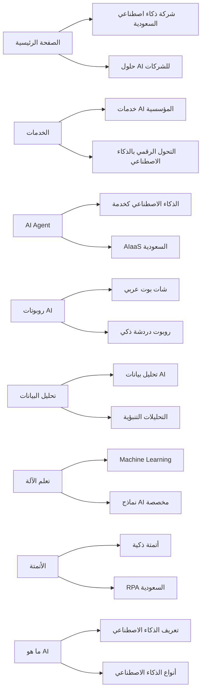

# 📊 تقرير الكلمات المفتاحية المستهدفة لموقع BrightAI
## السوق: المملكة العربية السعودية 🇸🇦
### التاريخ: 7 مارس 2026

---

> [!IMPORTANT]
> هذا التقرير يوضح الكلمات المفتاحية المقترحة لكل صفحة بناءً على بحث شامل في محركات البحث.
> مستوى المنافسة مُقدّر بناءً على تحليل السوق السعودي الحالي.

---

## 📋 ملخص الصفحات والكلمات المفتاحية

| # | الصفحة | عدد الكلمات المفتاحية الرئيسية | مستوى المنافسة |
|---|--------|-------------------------------|---------------|
| 1 | الصفحة الرئيسية | 12 | 🔴 مرتفع |
| 2 | الخدمات | 10 | 🔴 مرتفع |
| 3 | من نحن | 8 | 🟡 متوسط |
| 4 | AI Agent – الذكاء الاصطناعي كخدمة | 10 | 🟡 متوسط |
| 5 | روبوتات الذكاء الاصطناعي | 10 | 🟢 منخفض-متوسط |
| 6 | تحليل البيانات | 10 | 🔴 مرتفع |
| 7 | تعلم الآلة | 10 | 🟡 متوسط |
| 8 | الأتمتة الذكية | 10 | 🟡 متوسط |
| 9 | ما هو الذكاء الاصطناعي | 8 | 🔴 مرتفع |
| 10 | الاستشارة | 8 | 🟡 متوسط |
| 11 | التواصل | 6 | 🟢 منخفض |
| 12 | قصص النجاح | 8 | 🟢 منخفض |
| 13 | الشركاء | 6 | 🟢 منخفض |
| 14 | المدونة | 8 | 🟡 متوسط |

---

## 1️⃣ الصفحة الرئيسية (`/`)

**العنوان الحالي:** `Bright AI | حلول ذكاء اصطناعي للشركات | شركة ذكاء اصطناعي في السعودية`

### الكلمات المفتاحية الرئيسية (Head Keywords)

| الكلمة المفتاحية | النية البحثية | المنافسة | الأولوية |
|---|---|---|---|
| شركة ذكاء اصطناعي في السعودية | تجارية | 🔴 مرتفع | ⭐⭐⭐ |
| شركات الذكاء الاصطناعي في السعودية | تجارية | 🔴 مرتفع | ⭐⭐⭐ |
| حلول الذكاء الاصطناعي للشركات السعودية | تجارية | 🔴 مرتفع | ⭐⭐⭐ |
| خدمات الذكاء الاصطناعي في المملكة | تجارية | 🟡 متوسط | ⭐⭐⭐ |
| التحول الرقمي والذكاء الاصطناعي السعودية | معلوماتية/تجارية | 🟡 متوسط | ⭐⭐ |
| الذكاء الاصطناعي رؤية 2030 | معلوماتية | 🟡 متوسط | ⭐⭐ |

### الكلمات المفتاحية الطويلة (Long-tail Keywords)

| الكلمة المفتاحية | النية البحثية | المنافسة |
|---|---|---|
| أفضل شركة ذكاء اصطناعي في الرياض | تجارية | 🟢 منخفض |
| شركة حلول ذكاء اصطناعي للقطاع الخاص السعودي | تجارية | 🟢 منخفض |
| مزودي حلول الذكاء الاصطناعي في السعودية | تجارية | 🟢 منخفض |
| شركة تطوير أنظمة ذكاء اصطناعي مخصصة السعودية | تجارية | 🟢 منخفض |
| تكامل الذكاء الاصطناعي للشركات السعودية | تجارية | 🟢 منخفض |
| الذكاء الاصطناعي للمنشآت الصغيرة والمتوسطة السعودية | تجارية | 🟢 منخفض |

---

## 2️⃣ صفحة الخدمات (`/services/`)

**العنوان الحالي:** `خدمات AI المؤسسية للشركات | Bright AI`

### الكلمات المفتاحية الرئيسية

| الكلمة المفتاحية | النية البحثية | المنافسة | الأولوية |
|---|---|---|---|
| خدمات الذكاء الاصطناعي للشركات | تجارية | 🔴 مرتفع | ⭐⭐⭐ |
| حلول AI للقطاع المؤسسي | تجارية | 🟡 متوسط | ⭐⭐⭐ |
| خدمات التحول الرقمي بالذكاء الاصطناعي | تجارية | 🟡 متوسط | ⭐⭐⭐ |
| بناء أنظمة ذكاء اصطناعي مخصصة | تجارية | 🟡 متوسط | ⭐⭐ |
| تطوير حلول ذكاء اصطناعي | تجارية | 🟡 متوسط | ⭐⭐ |

### الكلمات المفتاحية الطويلة

| الكلمة المفتاحية | النية البحثية | المنافسة |
|---|---|---|
| خدمات ذكاء اصطناعي مؤسسية في السعودية | تجارية | 🟢 منخفض |
| حلول AI متكاملة للقطاع الخاص | تجارية | 🟢 منخفض |
| خدمات أتمتة العمليات بالذكاء الاصطناعي | تجارية | 🟢 منخفض |
| تطوير تطبيقات ذكاء اصطناعي للشركات السعودية | تجارية | 🟢 منخفض |
| خدمات تحليل البيانات والذكاء الاصطناعي للمؤسسات | تجارية | 🟢 منخفض |

---

## 3️⃣ صفحة من نحن (`/about/`)

**العنوان الحالي:** `من نحن في Bright AI السعودية | خبرتنا`

### الكلمات المفتاحية الرئيسية

| الكلمة المفتاحية | النية البحثية | المنافسة | الأولوية |
|---|---|---|---|
| شركة ذكاء اصطناعي سعودية | ملاحية | 🟡 متوسط | ⭐⭐⭐ |
| فريق خبراء الذكاء الاصطناعي السعودية | معلوماتية | 🟢 منخفض | ⭐⭐ |
| شركة تقنية سعودية ذكاء اصطناعي | تجارية | 🟡 متوسط | ⭐⭐ |
| شركة ناشئة ذكاء اصطناعي الرياض | معلوماتية | 🟢 منخفض | ⭐⭐ |

### الكلمات المفتاحية الطويلة

| الكلمة المفتاحية | النية البحثية | المنافسة |
|---|---|---|
| من هي شركة Bright AI السعودية | ملاحية | 🟢 منخفض |
| شركة ذكاء اصطناعي متخصصة في رؤية 2030 | معلوماتية | 🟢 منخفض |
| فريق تطوير ذكاء اصطناعي محلي سعودي | معلوماتية | 🟢 منخفض |
| خبرة شركات الذكاء الاصطناعي في الرياض | معلوماتية | 🟢 منخفض |

---

## 4️⃣ صفحة AI Agent (`/ai-agent/`)

**العنوان الحالي:** `الذكاء الاصطناعي كخدمة (AIaaS) للشركات السعودية | Bright AI`

### الكلمات المفتاحية الرئيسية

| الكلمة المفتاحية | النية البحثية | المنافسة | الأولوية |
|---|---|---|---|
| الذكاء الاصطناعي كخدمة | تجارية | 🟡 متوسط | ⭐⭐⭐ |
| AIaaS السعودية | تجارية | 🟢 منخفض | ⭐⭐⭐ |
| وكيل ذكاء اصطناعي للشركات | تجارية | 🟢 منخفض | ⭐⭐⭐ |
| AI Agent للأعمال | تجارية | 🟡 متوسط | ⭐⭐ |
| حلول ذكاء اصطناعي سحابية | تجارية | 🟡 متوسط | ⭐⭐ |

### الكلمات المفتاحية الطويلة

| الكلمة المفتاحية | النية البحثية | المنافسة |
|---|---|---|
| الذكاء الاصطناعي كخدمة للشركات الصغيرة والمتوسطة | تجارية | 🟢 منخفض |
| مزود خدمة AI as a Service في السعودية | تجارية | 🟢 منخفض |
| اشتراك خدمات ذكاء اصطناعي شهري السعودية | تجارية (معاملاتية) | 🟢 منخفض |
| حلول AI جاهزة للشركات السعودية | تجارية | 🟢 منخفض |
| تكلفة الذكاء الاصطناعي كخدمة في السعودية | تجارية | 🟢 منخفض |

---

## 5️⃣ صفحة روبوتات الذكاء الاصطناعي (`/ai-bots/`)

**العنوان الحالي:** `روبوتات ذكاء اصطناعي متقدمة للشركات السعودية | Bright AI`

### الكلمات المفتاحية الرئيسية

| الكلمة المفتاحية | النية البحثية | المنافسة | الأولوية |
|---|---|---|---|
| روبوتات المحادثة الذكية | تجارية | 🟡 متوسط | ⭐⭐⭐ |
| شات بوت ذكاء اصطناعي | تجارية | 🟡 متوسط | ⭐⭐⭐ |
| روبوت دردشة عربي | تجارية | 🟢 منخفض | ⭐⭐⭐ |
| بوت خدمة عملاء ذكي | تجارية | 🟢 منخفض | ⭐⭐ |
| روبوت محادثة مدعوم بالذكاء الاصطناعي | تجارية | 🟡 متوسط | ⭐⭐ |

### الكلمات المفتاحية الطويلة

| الكلمة المفتاحية | النية البحثية | المنافسة |
|---|---|---|
| شات بوت عربي للشركات السعودية | تجارية | 🟢 منخفض |
| روبوت محادثة ذكي لخدمة العملاء عربي | تجارية | 🟢 منخفض |
| بوت مبيعات ذكي بالعربي | تجارية | 🟢 منخفض |
| تطوير شات بوت مخصص للشركات السعودية | تجارية | 🟢 منخفض |
| روبوت دردشة ذكاء اصطناعي يدعم اللهجة السعودية | تجارية | 🟢 منخفض |

---

## 6️⃣ صفحة تحليل البيانات (`/data-analysis/`)

**العنوان الحالي:** `تحليل البيانات بـ AI | Bright AI`

### الكلمات المفتاحية الرئيسية

| الكلمة المفتاحية | النية البحثية | المنافسة | الأولوية |
|---|---|---|---|
| تحليل البيانات بالذكاء الاصطناعي | تجارية/معلوماتية | 🔴 مرتفع | ⭐⭐⭐ |
| تحليل بيانات الشركات السعودية | تجارية | 🟡 متوسط | ⭐⭐⭐ |
| ذكاء الأعمال والبيانات الضخمة | معلوماتية | 🟡 متوسط | ⭐⭐ |
| التحليلات التنبؤية AI | تجارية | 🟡 متوسط | ⭐⭐ |
| خدمات تحليل البيانات السعودية | تجارية | 🟡 متوسط | ⭐⭐⭐ |

### الكلمات المفتاحية الطويلة

| الكلمة المفتاحية | النية البحثية | المنافسة |
|---|---|---|
| تحليل بيانات بالذكاء الاصطناعي للشركات السعودية | تجارية | 🟢 منخفض |
| أدوات تحليل بيانات متقدمة AI | تجارية | 🟢 منخفض |
| حلول Business Intelligence بالذكاء الاصطناعي السعودية | تجارية | 🟢 منخفض |
| تصور البيانات وتحليلها بالذكاء الاصطناعي | معلوماتية | 🟢 منخفض |
| شركة تحليل بيانات ضخمة في الرياض | تجارية | 🟢 منخفض |

---

## 7️⃣ صفحة تعلم الآلة (`/machine-learning/`)

**العنوان الحالي:** `تعلم الآلة للأعمال | Bright AI`

### الكلمات المفتاحية الرئيسية

| الكلمة المفتاحية | النية البحثية | المنافسة | الأولوية |
|---|---|---|---|
| تعلم الآلة للشركات | تجارية | 🟡 متوسط | ⭐⭐⭐ |
| حلول التعلم الآلي | تجارية | 🟡 متوسط | ⭐⭐⭐ |
| Machine Learning السعودية | تجارية | 🟡 متوسط | ⭐⭐ |
| التعلم العميق Deep Learning | معلوماتية | 🟡 متوسط | ⭐⭐ |
| نماذج ذكاء اصطناعي مخصصة | تجارية | 🟢 منخفض | ⭐⭐⭐ |

### الكلمات المفتاحية الطويلة

| الكلمة المفتاحية | النية البحثية | المنافسة |
|---|---|---|
| تطوير نماذج تعلم آلة مخصصة للشركات السعودية | تجارية | 🟢 منخفض |
| تطبيقات تعلم الآلة في الأعمال السعودية | معلوماتية | 🟢 منخفض |
| بناء خوارزميات ذكاء اصطناعي للشركات | تجارية | 🟢 منخفض |
| خدمات التعلم الآلي والتنبؤ بالبيانات | تجارية | 🟢 منخفض |
| حلول Machine Learning لقطاع البنوك السعودي | تجارية | 🟢 منخفض |

---

## 8️⃣ صفحة الأتمتة الذكية (`/smart-automation/`)

**العنوان الحالي:** `الأتمتة الذكية وسير عمل AI | Bright AI السعودية`

### الكلمات المفتاحية الرئيسية

| الكلمة المفتاحية | النية البحثية | المنافسة | الأولوية |
|---|---|---|---|
| أتمتة ذكية بالذكاء الاصطناعي | تجارية | 🟡 متوسط | ⭐⭐⭐ |
| أتمتة الأعمال بالذكاء الاصطناعي | تجارية | 🟡 متوسط | ⭐⭐⭐ |
| أتمتة العمليات الروبوتية RPA | تجارية | 🟡 متوسط | ⭐⭐ |
| سير عمل ذكي AI | تجارية | 🟢 منخفض | ⭐⭐ |
| تحسين العمليات التشغيلية بالذكاء الاصطناعي | تجارية | 🟡 متوسط | ⭐⭐⭐ |

### الكلمات المفتاحية الطويلة

| الكلمة المفتاحية | النية البحثية | المنافسة |
|---|---|---|
| أتمتة العمليات بالذكاء الاصطناعي للشركات السعودية | تجارية | 🟢 منخفض |
| حلول أتمتة ذكية لقطاع الموارد البشرية | تجارية | 🟢 منخفض |
| تقليل التكاليف التشغيلية بالأتمتة الذكية | تجارية | 🟢 منخفض |
| أتمتة خدمة العملاء بالذكاء الاصطناعي | تجارية | 🟢 منخفض |
| حلول RPA والذكاء الاصطناعي للمؤسسات السعودية | تجارية | 🟢 منخفض |

---

## 9️⃣ صفحة ما هو الذكاء الاصطناعي (`/what-is-ai/`)

**العنوان الحالي:** `ما هو الذكاء الاصطناعي؟ | Bright AI - دليلك الشامل`

### الكلمات المفتاحية الرئيسية

| الكلمة المفتاحية | النية البحثية | المنافسة | الأولوية |
|---|---|---|---|
| ما هو الذكاء الاصطناعي | معلوماتية | 🔴 مرتفع | ⭐⭐⭐ |
| تعريف الذكاء الاصطناعي | معلوماتية | 🔴 مرتفع | ⭐⭐⭐ |
| الذكاء الاصطناعي شرح مبسط | معلوماتية | 🟡 متوسط | ⭐⭐ |
| أنواع الذكاء الاصطناعي | معلوماتية | 🟡 متوسط | ⭐⭐ |

### الكلمات المفتاحية الطويلة

| الكلمة المفتاحية | النية البحثية | المنافسة |
|---|---|---|
| ما هو الذكاء الاصطناعي وكيف يعمل | معلوماتية | 🟢 منخفض |
| شرح الذكاء الاصطناعي للمبتدئين بالعربي | معلوماتية | 🟢 منخفض |
| الذكاء الاصطناعي التوليدي شرح بسيط | معلوماتية | 🟡 متوسط |
| الفرق بين الذكاء الاصطناعي وتعلم الآلة | معلوماتية | 🟡 متوسط |

---

## 🔟 صفحة الاستشارة (`/consultation/`)

**العنوان الحالي:** `استشارة ذكاء اصطناعي | Bright AI`

### الكلمات المفتاحية الرئيسية

| الكلمة المفتاحية | النية البحثية | المنافسة | الأولوية |
|---|---|---|---|
| استشارات الذكاء الاصطناعي | تجارية | 🟡 متوسط | ⭐⭐⭐ |
| استشارة تحول رقمي بالذكاء الاصطناعي | تجارية | 🟡 متوسط | ⭐⭐⭐ |
| مستشار ذكاء اصطناعي السعودية | تجارية | 🟢 منخفض | ⭐⭐⭐ |
| استشارات تقنية AI | تجارية | 🟡 متوسط | ⭐⭐ |

### الكلمات المفتاحية الطويلة

| الكلمة المفتاحية | النية البحثية | المنافسة |
|---|---|---|
| حجز استشارة ذكاء اصطناعي مجانية | معاملاتية | 🟢 منخفض |
| استشارة تطبيق الذكاء الاصطناعي في شركتي | تجارية | 🟢 منخفض |
| خبير ذكاء اصطناعي للشركات السعودية | تجارية | 🟢 منخفض |
| استشارات الامتثال NCA والذكاء الاصطناعي | تجارية | 🟢 منخفض |

---

## 1️⃣1️⃣ صفحة التواصل (`/contact/`)

**العنوان الحالي:** `تواصل معنا اليوم | Bright AI الرياض`

### الكلمات المفتاحية الرئيسية

| الكلمة المفتاحية | النية البحثية | المنافسة | الأولوية |
|---|---|---|---|
| تواصل شركة ذكاء اصطناعي الرياض | ملاحية | 🟢 منخفض | ⭐⭐⭐ |
| عنوان شركة AI في الرياض | ملاحية | 🟢 منخفض | ⭐⭐ |
| طلب عرض سعر ذكاء اصطناعي | معاملاتية | 🟢 منخفض | ⭐⭐⭐ |

### الكلمات المفتاحية الطويلة

| الكلمة المفتاحية | النية البحثية | المنافسة |
|---|---|---|
| تواصل مع شركة حلول ذكاء اصطناعي في السعودية | ملاحية | 🟢 منخفض |
| طلب عرض سعر حلول AI للشركات | معاملاتية | 🟢 منخفض |
| حجز موعد استشارة ذكاء اصطناعي | معاملاتية | 🟢 منخفض |

---

## 1️⃣2️⃣ صفحة قصص النجاح (`/case-studies/`)

**العنوان الحالي:** `قصص نجاح العملاء | Bright AI السعودية`

### الكلمات المفتاحية الرئيسية

| الكلمة المفتاحية | النية البحثية | المنافسة | الأولوية |
|---|---|---|---|
| قصص نجاح الذكاء الاصطناعي | معلوماتية | 🟢 منخفض | ⭐⭐⭐ |
| دراسات حالة ذكاء اصطناعي السعودية | معلوماتية | 🟢 منخفض | ⭐⭐⭐ |
| نتائج تطبيق الذكاء الاصطناعي في الشركات | معلوماتية | 🟢 منخفض | ⭐⭐ |
| تجارب شركات سعودية مع الذكاء الاصطناعي | معلوماتية | 🟢 منخفض | ⭐⭐ |

### الكلمات المفتاحية الطويلة

| الكلمة المفتاحية | النية البحثية | المنافسة |
|---|---|---|
| كيف استفادت الشركات السعودية من الذكاء الاصطناعي | معلوماتية | 🟢 منخفض |
| ROI تطبيق الذكاء الاصطناعي في الشركات السعودية | معلوماتية | 🟢 منخفض |
| نتائج أتمتة العمليات بالذكاء الاصطناعي دراسة حالة | معلوماتية | 🟢 منخفض |
| قصة نجاح تحول رقمي بالذكاء الاصطناعي | معلوماتية | 🟢 منخفض |

---

## 1️⃣3️⃣ صفحة الشركاء (`/partners/`)

**العنوان الحالي:** `الشركاء والموزعين | Bright AI السعودية`

### الكلمات المفتاحية الرئيسية

| الكلمة المفتاحية | النية البحثية | المنافسة | الأولوية |
|---|---|---|---|
| شراكة تقنية ذكاء اصطناعي | تجارية | 🟢 منخفض | ⭐⭐ |
| شريك حلول AI السعودية | تجارية | 🟢 منخفض | ⭐⭐⭐ |
| برنامج شركاء ذكاء اصطناعي | تجارية | 🟢 منخفض | ⭐⭐ |

### الكلمات المفتاحية الطويلة

| الكلمة المفتاحية | النية البحثية | المنافسة |
|---|---|---|
| التسجيل كشريك لحلول الذكاء الاصطناعي | معاملاتية | 🟢 منخفض |
| شراكة مع شركة ذكاء اصطناعي في السعودية | تجارية | 🟢 منخفض |
| توزيع حلول AI في المملكة العربية السعودية | تجارية | 🟢 منخفض |

---

## 1️⃣4️⃣ صفحة المدونة (`/blog/`)

**العنوان الحالي:** `مدونة AI للشركات السعودية | Bright AI`

### الكلمات المفتاحية الرئيسية

| الكلمة المفتاحية | النية البحثية | المنافسة | الأولوية |
|---|---|---|---|
| مدونة ذكاء اصطناعي عربي | معلوماتية | 🟡 متوسط | ⭐⭐⭐ |
| أخبار الذكاء الاصطناعي السعودية | معلوماتية | 🟡 متوسط | ⭐⭐ |
| مقالات AI بالعربي | معلوماتية | 🟢 منخفض | ⭐⭐⭐ |
| دليل الذكاء الاصطناعي للشركات | معلوماتية | 🟡 متوسط | ⭐⭐ |

### الكلمات المفتاحية الطويلة

| الكلمة المفتاحية | النية البحثية | المنافسة |
|---|---|---|
| آخر أخبار الذكاء الاصطناعي في السعودية 2026 | معلوماتية | 🟢 منخفض |
| مقارنة ChatGPT و Claude و Gemini بالعربي | معلوماتية | 🟡 متوسط |
| أفضل أدوات الذكاء الاصطناعي للشركات السعودية | معلوماتية | 🟡 متوسط |
| كيف تختار شركة ذكاء اصطناعي في السعودية | معلوماتية | 🟢 منخفض |

---

## 📊 الكلمات المفتاحية حسب القطاعات المستهدفة

> [!TIP]
> هذه الكلمات المفتاحية القطاعية يمكن استخدامها عبر جميع الصفحات ذات الصلة وفي مقالات المدونة لتغطية نوايا بحث متنوعة.

### القطاع الصحي 🏥

| الكلمة المفتاحية | النية البحثية | المنافسة |
|---|---|---|
| الذكاء الاصطناعي في الرعاية الصحية السعودية | معلوماتية | 🟡 متوسط |
| حلول AI للمستشفيات السعودية | تجارية | 🟢 منخفض |
| أرشيف طبي ذكي | تجارية | 🟢 منخفض |
| تحليل البيانات الطبية بالذكاء الاصطناعي | تجارية | 🟢 منخفض |

### القطاع المالي والمصرفي 🏦

| الكلمة المفتاحية | النية البحثية | المنافسة |
|---|---|---|
| الذكاء الاصطناعي في البنوك السعودية | معلوماتية | 🟡 متوسط |
| كشف الاحتيال بالذكاء الاصطناعي | تجارية | 🟡 متوسط |
| حلول AI للقطاع المالي السعودي | تجارية | 🟢 منخفض |
| الامتثال SAMA والذكاء الاصطناعي | تجارية | 🟢 منخفض |

### قطاع التجارة الإلكترونية 🛒

| الكلمة المفتاحية | النية البحثية | المنافسة |
|---|---|---|
| الذكاء الاصطناعي في التجارة الإلكترونية السعودية | معلوماتية | 🟡 متوسط |
| تحسين تجربة العملاء بالذكاء الاصطناعي | تجارية | 🟡 متوسط |
| توصيات منتجات ذكية AI | تجارية | 🟢 منخفض |

### قطاع الطاقة والتصنيع ⚡

| الكلمة المفتاحية | النية البحثية | المنافسة |
|---|---|---|
| الصيانة التنبؤية بالذكاء الاصطناعي السعودية | تجارية | 🟢 منخفض |
| حلول AI لقطاع النفط والغاز | تجارية | 🟢 منخفض |
| أتمتة التصنيع بالذكاء الاصطناعي | تجارية | 🟢 منخفض |

### قطاع اللوجستيات 🚛

| الكلمة المفتاحية | النية البحثية | المنافسة |
|---|---|---|
| تحسين المسارات اللوجستية بالذكاء الاصطناعي | تجارية | 🟢 منخفض |
| حلول AI للخدمات اللوجستية السعودية | تجارية | 🟢 منخفض |
| إدارة سلسلة التوريد بالذكاء الاصطناعي | تجارية | 🟢 منخفض |

---

## 🎯 التوصيات الاستراتيجية

> [!WARNING]
> التوصيات التالية حرجة لتحقيق نتائج SEO فعّالة. يجب تنفيذها بحذر مع مراعاة عدم تعارضها مع المحتوى الحالي.

### أولويات فورية (خلال أسبوع)

1. **تحسين العناوين (Title Tags)**: بعض العناوين تحتاج تضمين الكلمة المفتاحية الأساسية بشكل أوضح
   - مثال: صفحة الخدمات → `خدمات الذكاء الاصطناعي المؤسسية للشركات السعودية | Bright AI`
   - مثال: صفحة تحليل البيانات → `تحليل البيانات بالذكاء الاصطناعي للشركات | Bright AI السعودية`

2. **تحديث Meta Descriptions**: تضمين الكلمات المفتاحية الرئيسية في وصف كل صفحة

3. **تعزيز المحتوى**: إضافة فقرات تستهدف الكلمات المفتاحية الطويلة في كل صفحة

### أولويات متوسطة المدى (خلال شهر)

4. **إنشاء محتوى مدونة**: كتابة مقالات جديدة تستهدف الكلمات المفتاحية القطاعية
5. **تحسين الروابط الداخلية**: ربط الصفحات ببعضها باستخدام نصوص وصلات (Anchor Text) تحتوي على الكلمات المفتاحية
6. **إضافة Schema Markup**: تعزيز البيانات المهيكلة لكل صفحة

### أولويات طويلة المدى (خلال 3 أشهر)

7. **بناء صفحات هبوط قطاعية**: إنشاء صفحات مخصصة لكل قطاع (صحة، بنوك، تجارة إلكترونية...)
8. **استهداف Featured Snippets**: تنسيق المحتوى بشكل يظهر في مقتطفات جوجل المميزة
9. **بناء روابط خلفية**: التركيز على الحصول على روابط من مواقع سعودية ذات سلطة عالية

---

## 📈 مؤشرات السوق السعودي

| المؤشر | القيمة |
|--------|--------|
| نمو سوق AI السعودي (CAGR 2025-2030) | **43.1%** |
| نسبة الشركات السعودية التي ستتبنى AI بحلول 2026 | **91%** |
| ترتيب السعودية عالمياً في أبحاث AI | **#15** |
| ترتيب السعودية عربياً في نمو AI | **#1** |
| نسبة مستخدمي AI من البالغين السعوديين | **80%** |

> [!NOTE]
> هذه المؤشرات تُظهر فرصة ضخمة في السوق السعودي. الطلب على خدمات الذكاء الاصطناعي في تصاعد مستمر، مما يجعل الاستثمار في SEO عربي مستهدف أمراً بالغ الأهمية.

---

## 🔗 خريطة الكلمات المفتاحية ← الصفحات

---

*تم إعداد هذا التقرير بتاريخ 7 مارس 2026 بناءً على بحث شامل في محركات البحث وتحليل للسوق السعودي.*
