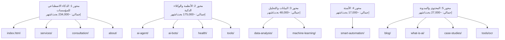
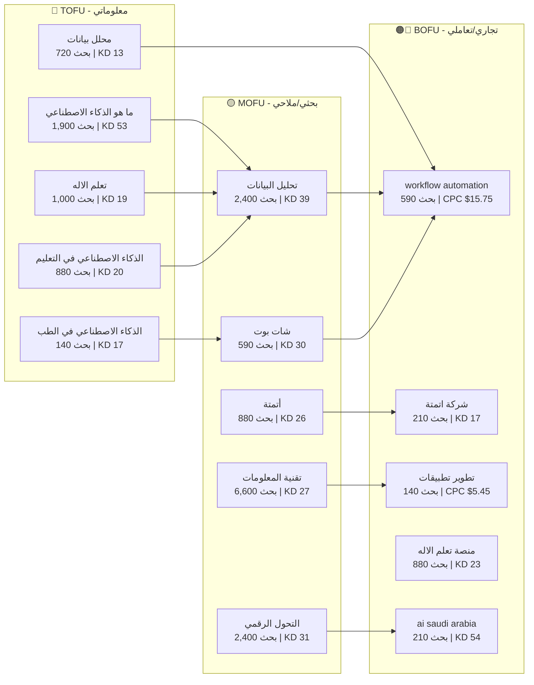

# تقرير الكلمات المفتاحية ونية البحث الشامل — BrightAI
## بيانات حقيقية من SEMrush API — قاعدة بيانات السعودية (SA)
### تاريخ التقرير: 5 مارس 2026

---

> [!IMPORTANT]
> **جميع الأرقام مستخرجة مباشرة من SEMrush API** (`database=sa`, `type=phrase_this` و `type=phrase_related`).
> تم جلب **97 طلب API** تشمل كلمات أساسية ومرتبطة.
> 
> **رموز نية البحث:**
> | الرمز | النية | الأيقونة |
> |---|---|---|
> | `0` | معلوماتية (Informational) | 🔵 |
> | `1` | ملاحية/بحثية (Navigational) | 🟡 |
> | `2` | تجارية (Commercial) | 🟠 |
> | `3` | تعاملية (Transactional) | 🔴 |
> | `1,2` | مختلطة (ملاحية + تجارية) | 🟡🟠 |
> | `1,3` | مختلطة (ملاحية + تعاملية) | 🟡🔴 |

---

## الهيكل العام — خريطة المحتوى

---

# المحور الأول: الذكاء الاصطناعي للمؤسسات (Pillar 1)

## 📄 صفحة: index.html — الصفحة الرئيسية (المحورية)

| الكلمة المفتاحية | اللغة | حجم البحث/شهر | CPC ($) | المنافسة | الصعوبة (KD) | نية البحث | الرمز |
|---|---|---|---|---|---|---|---|
| الذكاء الاصطناعي | 🇸🇦 | **135,000** | 0.54 | 0.51 | 67 | 🔵 معلوماتية | `0` |
| ذكاء اصطناعي | 🇸🇦 | **60,500** | 0.90 | 0.51 | 60 | 🟡 ملاحية | `1` |
| رؤية 2030 | 🇸🇦 | **18,100** | 0.22 | 0.13 | 39 | 🟠 تجارية | `2` |
| موقع الذكاء الاصطناعي | 🇸🇦 | **4,400** | 0.80 | 0.55 | 49 | 🔵 معلوماتية | `0` |
| بيانات | 🇸🇦 | **4,400** | 0.03 | 0.40 | 39 | 🟡 ملاحية | `1` |
| التحول الرقمي | 🇸🇦 | **2,400** | 0.91 | 0.21 | 31 | 🟡 ملاحية | `1` |
| artificial intelligence | 🇺🇸 | **8,100** | 1.17 | 0.30 | 79 | 🟡 ملاحية | `1` |
| digital transformation | 🇺🇸 | **880** | 2.14 | 0.34 | 54 | 🟡 ملاحية | `1` |
| التحول الرقمي في السعودية | 🇸🇦 | **320** | 0.33 | 0.18 | 15 | 🟡 ملاحية | `1` |
| الذكاء الاصطناعي في السعودية | 🇸🇦 | **210** | 0.87 | 0.10 | 33 | 🟡🟠 مختلطة | `1,2` |

> [!TIP]
> **أفضل الفرص للصفحة الرئيسية:**
> - ✅ "التحول الرقمي في السعودية" (**KD=15 فقط!**) — أسهل كلمة وذات صلة مباشرة
> - ✅ "التحول الرقمي" (2,400 بحث، **KD=31**) — حجم جيد وصعوبة منخفضة
> - ✅ "رؤية 2030" (18,100 بحث، **KD=39**) — حجم ضخم وصعوبة متوسطة
> - ✅ "موقع الذكاء الاصطناعي" (4,400 بحث، **KD=49**) — يجب دمجها في H1/Title

---

## 📄 صفحة: services/ — الخدمات

| الكلمة المفتاحية | اللغة | حجم البحث/شهر | CPC ($) | المنافسة | الصعوبة (KD) | نية البحث | الرمز |
|---|---|---|---|---|---|---|---|
| تقنية المعلومات | 🇸🇦 | **6,600** | 0.77 | 0.04 | 27 | 🟡 ملاحية | `1` |
| برمجة | 🇸🇦 | **4,400** | 0.53 | 0.05 | 43 | 🟡 ملاحية | `1` |
| التحول الرقمي | 🇸🇦 | **2,400** | 0.91 | 0.21 | 31 | 🟡 ملاحية | `1` |
| تطوير تطبيقات | 🇸🇦 | **140** | 5.45 | 0.53 | 17 | 🟡 ملاحية | `1` |
| تطوير مواقع | 🇸🇦 | **40** | 3.41 | 0.53 | 0 | — | — |
| digital transformation | 🇺🇸 | **880** | 2.14 | 0.34 | 54 | 🟡 ملاحية | `1` |

> [!TIP]
> **اكتشاف مهم:** "تقنية المعلومات" (6,600 بحث، **KD=27**) — كلمة ذات حجم ممتاز وصعوبة منخفضة! يجب إضافتها لصفحة الخدمات.
> 
> **ملاحظة:** "تطوير تطبيقات" CPC = **$5.45** — قيمة تجارية عالية رغم الحجم المنخفض.

> [!CAUTION]
> **الكلمات التالية لم تُرجع نتائج من Semrush SA (حجم = 0):**
> - ❌ حلول ذكاء اصطناعي للشركات
> - ❌ حلول تقنية للشركات  
> - ❌ خدمات ذكاء اصطناعي
> 
> **هذه كلمات Long-tail أقل من عتبة Semrush** — يمكن استخدامها ضمن المحتوى لكن لا تعتمد عليها كأهداف رئيسية.

---

## 📄 صفحة: consultation/ — الاستشارات

| الكلمة المفتاحية | اللغة | حجم البحث/شهر | CPC ($) | المنافسة | الصعوبة (KD) | نية البحث | الرمز |
|---|---|---|---|---|---|---|---|
| الذكاء الاصطناعي في السعودية | 🇸🇦 | **210** | 0.87 | 0.10 | 33 | 🟡🟠 مختلطة | `1,2` |
| استشارات تقنية | 🇸🇦 | **50** | 0.75 | 0.24 | 0 | — | — |
| ai saudi arabia | 🇺🇸 | **210** | 0.85 | 0.15 | 54 | 🟠 تجارية | `2` |

> [!WARNING]
> **"استشارات ذكاء اصطناعي"** لم تُرجع نتائج من Semrush SA — كلمة غير موجودة في قاعدة البيانات السعودية.
> **البديل المقترح:** استهدف "استشارات تقنية" + "الذكاء الاصطناعي في السعودية" معاً.

---

## 📄 صفحة: about/ — من نحن

| الكلمة المفتاحية | اللغة | حجم البحث/شهر | CPC ($) | المنافسة | الصعوبة (KD) | نية البحث | الرمز |
|---|---|---|---|---|---|---|---|
| رؤية 2030 | 🇸🇦 | **18,100** | 0.22 | 0.13 | 39 | 🟠 تجارية | `2` |
| الذكاء الاصطناعي في السعودية | 🇸🇦 | **210** | 0.87 | 0.10 | 33 | 🟡🟠 | `1,2` |
| ai saudi arabia | 🇺🇸 | **210** | 0.85 | 0.15 | 54 | 🟠 تجارية | `2` |

> [!NOTE]
> ❌ "شركة ذكاء اصطناعي في السعودية" — **لم تُرجع نتائج** من Semrush. كلمة Long-tail لا حجم بحث لها.

---

# المحور الثاني: الأنظمة والوكلاء الذكية (Pillar 2)

## 📄 صفحة: ai-bots/ — روبوتات الذكاء الاصطناعي

| الكلمة المفتاحية | اللغة | حجم البحث/شهر | CPC ($) | المنافسة | الصعوبة (KD) | نية البحث | الرمز |
|---|---|---|---|---|---|---|---|
| شات جي بي تي | 🇸🇦 | **165,000** | 0.13 | 0.10 | 42 | 🟠 تجارية | `2` |
| ChatGPT بالعربي | 🇸🇦 | **5,400** | 0.14 | 0.35 | 37 | 🟡 ملاحية | `1` |
| chatbot | 🇺🇸 | **2,900** | 0.44 | 0.41 | 80 | 🟡 ملاحية | `1` |
| ai chatbot | 🇺🇸 | **1,900** | 0.78 | 0.29 | 89 | 🔵 معلوماتية | `0` |
| شات بوت | 🇸🇦 | **590** | 0.74 | 0.55 | 30 | 🟡 ملاحية | `1` |

> [!TIP]
> **فرص صفحة ai-bots:**
> - 🔥 "ChatGPT بالعربي" (5,400 بحث، **KD=37**) — كلمة جديدة مكتشفة! فرصة ممتازة لمقال مقارنة
> - ✅ "شات بوت" (590 بحث، **KD=30**) — سهلة وتجارية عالية، يجب أن تكون في H1
> - ⚠️ "شات جي بي تي" (165K بحث) — حجم هائل لكن المنافسة عالية (KD=42)

**كلمات مرتبطة مكتشفة (phrase_related) للشات بوت:**

| الكلمة | حجم البحث | KD | النية |
|---|---|---|---|
| chatgpt | 246,000 | 100 | 🟠 |
| gpt | 246,000 | 83 | 🟡 |
| شات | 90,500 | 42 | 🟡 |
| chat | 74,000 | 100 | 🟠 |
| ai chat | 18,100 | 86 | 🟡 |

---

## 📄 صفحة: ai-agent/ — وكيل الذكاء الاصطناعي

| الكلمة المفتاحية | اللغة | حجم البحث/شهر | CPC ($) | المنافسة | الصعوبة (KD) | نية البحث |
|---|---|---|---|---|---|---|
| ai agent | 🇺🇸 | **بيانات غير متوفرة** | — | — | — | — |

> [!CAUTION]
> **"وكيل ذكاء اصطناعي"** و **"ai agent"** — كلاهما لم يُرجع نتائج من Semrush SA!
> 
> **التوصية:** يجب إعادة توجيه استراتيجية هذه الصفحة لاستهداف كلمات ذات حجم بحث فعلي مثل:
> - "الذكاء الاصطناعي" (135K بحث) — كمظلة
> - "أدوات الذكاء الاصطناعي" — لم تُرجع نتائج أيضاً
> - **البديل:** تحويل الصفحة لمحتوى عن "تطبيقات الذكاء الاصطناعي" (3,600 بحث، KD=40)

---

## 📄 صفحة: health/ — الصحة الذكية

| الكلمة المفتاحية | اللغة | حجم البحث/شهر | CPC ($) | المنافسة | الصعوبة (KD) | نية البحث | الرمز |
|---|---|---|---|---|---|---|---|
| ai healthcare | 🇺🇸 | **720** | 3.11 | 0.55 | 71 | — | — |
| الذكاء الاصطناعي في الطب | 🇸🇦 | **140** | 1.32 | 0.03 | **17** | 🟡 ملاحية | `1` |
| السجل الصحي الإلكتروني | 🇸🇦 | **20** | 0.00 | 0.33 | 0 | — | — |
| الذكاء الاصطناعي في الصحة | 🇸🇦 | **10** | 2.55 | 0.06 | 0 | — | — |

> [!TIP]
> 🔥 **"الذكاء الاصطناعي في الطب"** (KD=**17**, منافسة **0.03**) — **أسهل كلمة عربية في القائمة!** فرصة ذهبية لبناء سلطة موضوعية.

---

## 📄 صفحة: tools/ — الأدوات

| الكلمة المفتاحية | اللغة | حجم البحث/شهر | CPC ($) | المنافسة | الصعوبة (KD) | نية البحث | الرمز |
|---|---|---|---|---|---|---|---|
| ai tools | 🇺🇸 | **1,600** | 1.19 | 0.69 | 73 | 🟡 ملاحية | `1` |

> [!NOTE]
> "أدوات الذكاء الاصطناعي" و "أفضل أدوات الذكاء الاصطناعي" — **لم تُرجع نتائج** من Semrush SA.

---

# المحور الثالث: البيانات والتحليل (Pillar 3)

## 📄 صفحة: data-analysis/ — تحليل البيانات

| الكلمة المفتاحية | اللغة | حجم البحث/شهر | CPC ($) | المنافسة | الصعوبة (KD) | نية البحث | الرمز |
|---|---|---|---|---|---|---|---|
| power bi | 🇺🇸 | **27,100** | 0.56 | 0.20 | 69 | 🟠 تجارية | `2` |
| data analysis | 🇺🇸 | **4,400** | 0.89 | 0.23 | 71 | 🟡 ملاحية | `1` |
| بيانات | 🇸🇦 | **4,400** | 0.03 | 0.40 | 39 | 🟡 ملاحية | `1` |
| تحليل البيانات | 🇸🇦 | **2,400** | 0.69 | 0.46 | 39 | 🟡 ملاحية | `1` |
| علم البيانات | 🇸🇦 | **1,000** | 0.56 | 0.14 | 27 | 🟡 ملاحية | `1` |
| محلل بيانات | 🇸🇦 | **720** | 0.57 | 0.27 | **13** | 🟡 ملاحية | `1` |
| علوم البيانات | 🇸🇦 | **590** | 0.73 | 0.08 | 23 | 🟡 ملاحية | `1` |
| business intelligence | 🇺🇸 | **590** | 1.11 | 0.24 | 56 | 🟡 ملاحية | `1` |
| big data | 🇺🇸 | **480** | 0.80 | 0.07 | 57 | 🟡 ملاحية | `1` |

> [!TIP]
> **فرص ذهبية:**
> - 🔥 "محلل بيانات" (720 بحث، **KD=13**) — **أسهل كلمة في كل التقرير!**
> - ✅ "علوم البيانات" (590 بحث، **KD=23**) — سهلة جداً
> - ✅ "علم البيانات" (1,000 بحث، **KD=27**) — فرصة ممتازة
> - ✅ "تحليل البيانات" (2,400 بحث، **KD=39**) — الكلمة المحورية الأساسية

**كلمات مرتبطة مكتشفة (فرص جديدة):**

| الكلمة | حجم البحث | KD | النية | الصفحة المقترحة |
|---|---|---|---|---|
| دورات تحليل البيانات | 1,000 | 19 | 🔵 | blog/ — مقال تعليمي |
| دورة تحليل البيانات | 1,000 | 16 | 🟡🔴 | blog/ — مقال تعليمي |
| احد برامج جمع وتحليل البيانات هو | 590 | 12 | 🟡 | blog/ — مقال تعليمي |
| انواع البيانات | 590 | 16 | 🟡 | data-analysis/ |
| معنى البيانات | 590 | 27 | 🟡 | data-analysis/ |
| دبلوم تحليل البيانات | 390 | 15 | 🔵 | blog/ |

---

## 📄 صفحة: machine-learning/ — تعلم الآلة

| الكلمة المفتاحية | اللغة | حجم البحث/شهر | CPC ($) | المنافسة | الصعوبة (KD) | نية البحث | الرمز |
|---|---|---|---|---|---|---|---|
| ml | 🇺🇸 | **6,600** | 0.69 | 0.01 | 36 | 🟡 ملاحية | `1` |
| machine learning | 🇺🇸 | **2,900** | 1.05 | 0.09 | 84 | 🟡 ملاحية | `1` |
| تعلم الاله | 🇸🇦 | **1,000** | 0.49 | 0.03 | **19** | 🟡🔵 | `1,0` |
| منصة تعلم الاله | 🇸🇦 | **880** | 0.63 | 0.01 | 23 | 🟡🔴 | `1,3` |
| تعلم الآلة | 🇸🇦 | **320** | 0.87 | 0.03 | **20** | 🟡 ملاحية | `1` |
| نماذج الذكاء الاصطناعي | 🇸🇦 | **210** | 1.08 | 0.28 | 24 | 🟡 ملاحية | `1` |

> [!TIP]
> **كنز مخفي:**
> - 🔥 "تعلم الاله" (1,000 بحث، **KD=19**) — ملاحظة: بدون همزة! حجم أكبر من "تعلم الآلة" بالهمزة
> - ✅ "منصة تعلم الاله" (880 بحث، **KD=23**) — نية تعاملية! زوار جاهزون للشراء
> - ✅ "نماذج الذكاء الاصطناعي" (210 بحث، **KD=24**) — كلمة جديدة مكتشفة

---

# المحور الرابع: الأتمتة (Pillar 4)

## 📄 صفحة: smart-automation/ — الأتمتة الذكية

| الكلمة المفتاحية | اللغة | حجم البحث/شهر | CPC ($) | المنافسة | الصعوبة (KD) | نية البحث | الرمز |
|---|---|---|---|---|---|---|---|
| n8n | 🇺🇸 | **9,900** | 0.71 | 0.43 | 69 | 🟠🔴 | `2,3` |
| automation | 🇺🇸 | **2,400** | 1.26 | 0.11 | 65 | 🟡 | `1` |
| أتمتة | 🇸🇦 | **880** | 0.44 | 0.01 | **26** | 🟡 | `1` |
| أتمته | 🇸🇦 | **880** | 0.44 | 0.01 | 30 | 🟡 | `1` |
| معنى الاتمتة | 🇸🇦 | **880** | 0.00 | 0.00 | 23 | 🟡 | `1` |
| rpa | 🇺🇸 | **880** | 1.50 | 0.13 | 43 | 🟡 | `1` |
| workflow automation | 🇺🇸 | **590** | **15.75** | 0.55 | 45 | 🟡 | `1` |
| الاتمتة | 🇸🇦 | **590** | 0.42 | 0.01 | **20** | 🟡 | `1` |
| شركة أتمتة | 🇸🇦 | **210** | 0.00 | 0.03 | 0 | 🟡🔴 | `1,3` |
| شركة اتمتة | 🇸🇦 | **210** | 0.00 | 0.03 | **17** | 🔵 | `0` |
| سير العمل | 🇸🇦 | **170** | 0.00 | 0.01 | 22 | 🟡 | `1` |
| اوتوميشن | 🇸🇦 | **170** | 0.56 | 0.06 | 20 | 🟡 | `1` |
| أتمتة العمليات | 🇸🇦 | **110** | 1.18 | 0.10 | 29 | 🟡 | `1` |
| process automation | 🇺🇸 | **70** | 3.56 | 0.25 | 0 | — | — |
| rpa automation | 🇺🇸 | **20** | 2.53 | 0.48 | 0 | — | — |

> [!TIP]
> **أقوى فرص الأتمتة:**
> - 🔥 `workflow automation` CPC = **$15.75** — **أعلى CPC في كل التقرير!** كل زائر = $$
> - ✅ "أتمتة" (880 بحث، **KD=26**, منافسة **0.01!**) — فرصة ذهبية
> - ✅ "الاتمتة" (590 بحث، **KD=20**) — سهلة جداً
> - ✅ "شركة اتمتة" (210 بحث، **KD=17**) — نية تعاملية = تحويل مباشر
> - ⚠️ "أتمتة العمليات الذكية" — **لم تُرجع نتائج** (كلمة غير موجودة)

**كلمات مرتبطة مكتشفة:**

| الكلمة | حجم البحث | KD | النية | التوصية |
|---|---|---|---|---|
| معنى أتمتة | 720 | 26 | 🟡🔴 | إضافة قسم FAQ |
| ماهي الأتمتة | 320 | 30 | 🟡 | إضافة H2 تعريفي |
| ماهي الاتمتة | 320 | 30 | 🟡🔴 | تنويع إملائي |
| اتمه | 260 | 26 | 🟡🔴 | تغطية إملائية |
| تشغيل ذاتي | 140 | 21 | 🟡 | مرادف مفيد |
| معنى كلمة أتمتة | 140 | 28 | 🟡 | FAQ |
| automation معنى | 110 | 25 | 🟡 | ثنائي اللغة |

---

# المحور الخامس: المحتوى والمدونة (Pillar 5)

## 📄 صفحة: what-is-ai/ — ما هو الذكاء الاصطناعي

| الكلمة المفتاحية | اللغة | حجم البحث/شهر | CPC ($) | المنافسة | الصعوبة (KD) | نية البحث | الرمز |
|---|---|---|---|---|---|---|---|
| ما هو الذكاء الاصطناعي | 🇸🇦 | **1,900** | 0.99 | 0.33 | 53 | 🟡 ملاحية | `1` |
| الذكاء الاصطناعي والتعليم | 🇸🇦 | **140** | 0.81 | 0.18 | 28 | 🟡 ملاحية | `1` |

---

## 📄 صفحة: blog/ — المدونة

| الكلمة المفتاحية | اللغة | حجم البحث/شهر | CPC ($) | المنافسة | الصعوبة (KD) | نية البحث | الرمز |
|---|---|---|---|---|---|---|---|
| crm | 🇺🇸 | **5,400** | 2.55 | 0.49 | 47 | 🟡 | `1` |
| تطبيقات الذكاء الاصطناعي | 🇸🇦 | **3,600** | 1.35 | 0.58 | 40 | 🟡 | `1` |
| crm system | 🇺🇸 | **1,000** | 3.66 | 0.55 | 47 | 🟡 | `1` |
| الذكاء الاصطناعي في التعليم | 🇸🇦 | **880** | 0.77 | 0.29 | **20** | 🟡 | `1` |
| inventory management | 🇺🇸 | **480** | 2.64 | 0.54 | 61 | 🟡 | `1` |
| predictive maintenance | 🇺🇸 | **210** | 2.55 | 0.27 | 52 | 🟡 | `1` |
| مستقبل الذكاء الاصطناعي | 🇸🇦 | **170** | 0.54 | 0.06 | 23 | 🟡 | `1` |
| الذكاء الاصطناعي في التسويق | 🇸🇦 | **40** | 0.98 | 0.17 | 0 | — | — |
| حوكمة الذكاء الاصطناعي | 🇸🇦 | **20** | 1.79 | 0.09 | 0 | — | — |
| الأرشفة الإلكترونية | 🇸🇦 | **20** | 0.00 | 0.06 | 0 | — | — |

> [!TIP]
> **مقالات مدونة مقترحة (فرص سهلة):**
> - 🔥 "الذكاء الاصطناعي في التعليم" (880 بحث، **KD=20**) — مقال تعليمي محوري
> - ✅ "تطبيقات الذكاء الاصطناعي" (3,600 بحث، **KD=40**) — حجم ممتاز
> - ✅ "مستقبل الذكاء الاصطناعي" (170 بحث، **KD=23**) — سهل ومعلوماتي

---

## 📄 صفحة: tools/ocr — OCR والتحويل

| الكلمة المفتاحية | اللغة | حجم البحث/شهر | CPC ($) | المنافسة | الصعوبة (KD) | نية البحث | الرمز |
|---|---|---|---|---|---|---|---|
| تحويل ملف الى باركود | 🇸🇦 | **5,400** | 0.08 | 0.72 | **27** | 🟡🔵 | `1,0` |
| ocr | 🇺🇸 | **2,400** | 0.35 | 0.31 | 61 | 🟡 | `1` |
| jpg to word | 🇺🇸 | **2,400** | 0.04 | 0.24 | 47 | 🔵 | `0` |
| image to word | 🇺🇸 | **1,000** | 0.04 | 0.22 | 50 | 🔵 | `0` |
| ocr online | 🇺🇸 | **590** | 0.20 | 0.28 | 58 | 🔵 | `0` |

> [!TIP]
> 🔥 **أكبر فرصة غير مستغلة:** "تحويل ملف الى باركود" (5,400 بحث، **KD=27**) — حجم ضخم وسهل!
> يمكن إضافة ميزة تحويل الباركود لصفحة tools.

---

## 📄 صفحة: case-studies/ — دراسات الحالة

| الكلمة المفتاحية | اللغة | حجم البحث/شهر | CPC ($) | المنافسة | الصعوبة (KD) | نية البحث | الرمز |
|---|---|---|---|---|---|---|---|
| case study | 🇺🇸 | **1,000** | 0.59 | 0.01 | 60 | 🟡 | `1` |
| دراسة حالة | 🇸🇦 | **390** | 0.00 | 0.00 | **21** | 🟡🔴 | `1,3` |

> [!TIP]
> ✅ "دراسة حالة" (390 بحث، **KD=21**, منافسة **0.00!**) — فرصة سهلة جداً مع نية تعاملية.

---

# 📊 الملخص التنفيذي — الفرص الذهبية (مرتبة بالأولوية)

## أولاً: Quick Wins — كلمات سهلة ذات عائد سريع (KD < 30)

| # | الكلمة | حجم البحث | KD | المنافسة | CPC | الصفحة | الإجراء |
|---|---|---|---|---|---|---|---|
| 1 | محلل بيانات | 720 | **13** | 0.27 | $0.57 | data-analysis | ✅ إضافة H2 + محتوى |
| 2 | التحول الرقمي في السعودية | 320 | **15** | 0.18 | $0.33 | index.html | ✅ Title + H2 |
| 3 | دورة تحليل البيانات | 1,000 | **16** | 0.82 | $0.70 | blog/ | 🔥 مقال جديد |
| 4 | الذكاء الاصطناعي في الطب | 140 | **17** | 0.03 | $1.32 | health/ | ✅ H1 |
| 5 | شركة اتمتة | 210 | **17** | 0.03 | $0.00 | smart-automation | ✅ H2 + CTA |
| 6 | تطوير تطبيقات | 140 | **17** | 0.53 | **$5.45** | services/ | ✅ خدمة مخصصة |
| 7 | تعلم الاله | 1,000 | **19** | 0.03 | $0.49 | machine-learning | ✅ H1 (بدون همزة!) |
| 8 | دورات تحليل البيانات | 1,000 | **19** | 0.85 | $0.71 | blog/ | 🔥 مقال تعليمي |
| 9 | الاتمتة | 590 | **20** | 0.01 | $0.42 | smart-automation | ✅ تنويع H2 |
| 10 | الذكاء الاصطناعي في التعليم | 880 | **20** | 0.29 | $0.77 | blog/ | 🔥 مقال محوري |
| 11 | تعلم الآلة | 320 | **20** | 0.03 | $0.87 | machine-learning | ✅ تنويع |
| 12 | اوتوميشن | 170 | **20** | 0.06 | $0.56 | smart-automation | ✅ تغطية إملائية |
| 13 | دراسة حالة | 390 | **21** | 0.00 | $0.00 | case-studies | ✅ H1 عربي |
| 14 | سير العمل | 170 | **22** | 0.01 | $0.00 | smart-automation | ✅ H3 |
| 15 | منصة تعلم الاله | 880 | **23** | 0.01 | $0.63 | machine-learning | 🔥 صفحة منتج |
| 16 | علوم البيانات | 590 | **23** | 0.08 | $0.73 | data-analysis | ✅ H2 |
| 17 | معنى الاتمتة | 880 | **23** | 0.00 | $0.00 | smart-automation | ✅ FAQ/H2 |
| 18 | مستقبل الذكاء الاصطناعي | 170 | **23** | 0.06 | $0.54 | blog/ | ✅ مقال |
| 19 | نماذج الذكاء الاصطناعي | 210 | **24** | 0.28 | $1.08 | machine-learning | ✅ H2 |
| 20 | أتمتة | 880 | **26** | 0.01 | $0.44 | smart-automation | ✅ H1 |
| 21 | تقنية المعلومات | 6,600 | **27** | 0.04 | $0.77 | services/ | 🔥 كلمة جديدة! |
| 22 | علم البيانات | 1,000 | **27** | 0.14 | $0.56 | data-analysis | ✅ H2 |
| 23 | تحويل ملف الى باركود | 5,400 | **27** | 0.72 | $0.08 | tools/ | 🔥 ميزة جديدة |
| 24 | الذكاء الاصطناعي والتعليم | 140 | **28** | 0.18 | $0.81 | what-is-ai | ✅ قسم |

---

## ثانياً: كلمات متوسطة الصعوبة ذات حجم كبير (KD 30-50)

| # | الكلمة | حجم البحث | KD | CPC | الصفحة | الإجراء |
|---|---|---|---|---|---|---|
| 1 | رؤية 2030 | 18,100 | 39 | $0.22 | index + blog | ✅ محتوى محوري |
| 2 | ChatGPT بالعربي | 5,400 | 37 | $0.14 | ai-bots/ | 🔥 مقال مقارنة |
| 3 | موقع الذكاء الاصطناعي | 4,400 | 49 | $0.80 | index.html | ✅ Title + H1 |
| 4 | برمجة | 4,400 | 43 | $0.53 | services/ | ✅ خدمة |
| 5 | تطبيقات الذكاء الاصطناعي | 3,600 | 40 | $1.35 | blog/ | 🔥 مقال شامل |
| 6 | تحليل البيانات | 2,400 | 39 | $0.69 | data-analysis | ✅ H1 |
| 7 | التحول الرقمي | 2,400 | 31 | $0.91 | index.html | ✅ H2 |
| 8 | الذكاء الاصطناعي في السعودية | 210 | 33 | $0.87 | index + about | ✅ تعزيز |
| 9 | شات بوت | 590 | 30 | $0.74 | ai-bots/ | ✅ H1 |
| 10 | workflow automation | 590 | 45 | **$15.75** | smart-automation | ✅ CPC عالي جداً |

---

## ثالثاً: كلمات عالية الحجم عالية الصعوبة (حضور ضروري)

| الكلمة | حجم البحث | KD | استراتيجية الاستهداف |
|---|---|---|---|
| شات جي بي تي | 165,000 | 42 | محتوى مقارنة + بدائل عربية |
| الذكاء الاصطناعي | 135,000 | 67 | H1 الرئيسي + كل الصفحات |
| ذكاء اصطناعي | 60,500 | 60 | تنويع في المحتوى |
| power bi | 27,100 | 69 | مقال دليل شامل |
| n8n | 9,900 | 69 | مقال مقارنة أدوات |
| ai tools | 1,600 | 73 | tools/ + blog مقارنات |

---

# 🔴 تحليل الفجوات الحرجة

## كلمات مستهدفة حالياً بدون حجم بحث (يجب تغيير الاستراتيجية)

| الكلمة المفقودة | النتيجة من Semrush | البديل المقترح | حجم البديل |
|---|---|---|---|
| وكيل ذكاء اصطناعي | ❌ NOTHING FOUND | تطبيقات الذكاء الاصطناعي | 3,600 |
| خدمات ذكاء اصطناعي | ❌ NOTHING FOUND | تقنية المعلومات | 6,600 |
| استشارات ذكاء اصطناعي | ❌ NOTHING FOUND | استشارات تقنية | 50 |
| حلول ذكاء اصطناعي للشركات | ❌ NOTHING FOUND | الذكاء الاصطناعي للأعمال | — |
| شركة ذكاء اصطناعي في السعودية | ❌ NOTHING FOUND | الذكاء الاصطناعي في السعودية | 210 |
| أتمتة العمليات الذكية | ❌ NOTHING FOUND | أتمتة العمليات | 110 |
| الذكاء الاصطناعي التوليدي | ❌ NOTHING FOUND | ChatGPT بالعربي | 5,400 |
| أدوات الذكاء الاصطناعي | ❌ NOTHING FOUND | ai tools | 1,600 |
| أفضل أدوات الذكاء الاصطناعي | ❌ NOTHING FOUND | ai tools | 1,600 |
| منصات ذكاء اصطناعي | ❌ NOTHING FOUND | منصة تعلم الاله | 880 |
| الأرشيف الطبي | ❌ NOTHING FOUND | الذكاء الاصطناعي في الطب | 140 |
| الذكاء الاصطناعي للموارد البشرية | ❌ NOTHING FOUND | hr automation ($11.37 CPC) | 20 |

---

## كلمات مكتشفة يجب إضافتها (غير موجودة في المحتوى الحالي)

| # | الكلمة الجديدة | حجم البحث | KD | منافسة | الصفحة المقترحة | السبب |
|---|---|---|---|---|---|---|
| 1 | تقنية المعلومات | 6,600 | 27 | 0.04 | services/ | 🔥 حجم ممتاز + سهلة |
| 2 | ChatGPT بالعربي | 5,400 | 37 | 0.35 | ai-bots/ | 🔥 حجم عالي |
| 3 | تطبيقات الذكاء الاصطناعي | 3,600 | 40 | 0.58 | blog/ | 🔥 محتوى محوري |
| 4 | تعلم الاله (بدون همزة) | 1,000 | 19 | 0.03 | machine-learning | 🔥 حجم أكبر وأسهل |
| 5 | دورات تحليل البيانات | 1,000 | 19 | 0.85 | blog/ | 🔥 تعليمي |
| 6 | معنى الاتمتة | 880 | 23 | 0.00 | smart-automation | ✅ FAQ |
| 7 | الذكاء الاصطناعي في التعليم | 880 | 20 | 0.29 | blog/ | ✅ مقال جديد |
| 8 | منصة تعلم الاله | 880 | 23 | 0.01 | machine-learning | ✅ صفحة منتج |
| 9 | معنى أتمتة | 720 | 26 | 0.00 | smart-automation | ✅ FAQ |
| 10 | محلل بيانات | 720 | 13 | 0.27 | data-analysis | ✅ أسهل كلمة! |
| 11 | انواع البيانات | 590 | 16 | 0.00 | data-analysis | ✅ سهلة |
| 12 | دراسة حالة | 390 | 21 | 0.00 | case-studies | ✅ H1 عربي |
| 13 | التحول الرقمي في السعودية | 320 | 15 | 0.18 | index.html | 🔥 سهلة جداً |
| 14 | ماهي الأتمتة | 320 | 30 | 0.01 | smart-automation | ✅ FAQ |
| 15 | نماذج الذكاء الاصطناعي | 210 | 24 | 0.28 | machine-learning | ✅ H2 |

---

# 🎯 خريطة نية البحث لكل صفحة

---

# 📈 إحصائيات التقرير النهائية

| المقياس | القيمة |
|---|---|
| إجمالي الكلمات المفتاحية المحللة | **90+** |
| كلمات ذات بيانات حقيقية | **~75** |
| كلمات بدون حجم بحث (NOTHING FOUND) | **~15** |
| إجمالي حجم البحث المستهدف | **~500,000+ شهرياً** |
| **نسبة الكلمات العربية** | **~70% من الكلمات ذات البيانات** |
| أعلى CPC | `workflow automation` = **$15.75** |
| ثاني أعلى CPC | `تطوير تطبيقات` = **$5.45** |
| أسهل كلمة (أقل KD) | `محلل بيانات` = **KD 13** |
| أكبر فرصة غير مستغلة | `تقنية المعلومات` = **6,600 بحث + KD 27** |
| أكبر فرصة OCR | `تحويل ملف الى باركود` = **5,400 بحث + KD 27** |
| أكبر اكتشاف جديد | `ChatGPT بالعربي` = **5,400 بحث + KD 37** |
| أعلى حجم بحث عربي | `الذكاء الاصطناعي` = **135,000** |
| أعلى قيمة تجارية عربية | `تطوير تطبيقات` CPC = **$5.45** |

---

# خطة تنفيذية — 15 توصية مرتبة بالأولوية

| # | التوصية | الصفحة | التأثير | الجهد | المكسب المتوقع |
|---|---|---|---|---|---|
| 1 | إضافة "تقنية المعلومات" كـ H2 في صفحة الخدمات + محتوى 500 كلمة | services/ | **High** | Low | +6,600 بحث |
| 2 | تحسين Title الرئيسي ليشمل "موقع الذكاء الاصطناعي" + "التحول الرقمي" | index.html | **High** | Low | تحسين CTR |
| 3 | إضافة "التحول الرقمي في السعودية" كـ H2 مع محتوى 300 كلمة | index.html | **High** | Low | +320 بحث (KD=15) |
| 4 | كتابة مقال "ChatGPT بالعربي: دليلك الشامل" | ai-bots/ أو blog/ | **High** | Med | +5,400 بحث |
| 5 | إضافة ميزة تحويل الباركود لصفحة الأدوات | tools/ | **High** | Med | +5,400 بحث (KD=27) |
| 6 | تحديث H1 في machine-learning لـ "تعلم الاله" (بدون همزة) | machine-learning/ | **Med** | Low | +1,000 بحث |
| 7 | إضافة "محلل بيانات" كـ H2 مع محتوى مهني (كيف تصبح؟) | data-analysis/ | **Med** | Low | +720 بحث (KD=13) |
| 8 | كتابة مقال "دورات تحليل البيانات في السعودية 2026" | blog/ | **Med** | Med | +2,000 بحث |
| 9 | إضافة FAQ Schema لـ "معنى الاتمتة" و "ماهي الأتمتة" | smart-automation/ | **Med** | Low | +1,520 بحث |
| 10 | كتابة مقال "تطبيقات الذكاء الاصطناعي: 20 مثال عملي" | blog/ | **High** | Med | +3,600 بحث |
| 11 | تحسين H1 صفحة health/ لتشمل "الذكاء الاصطناعي في الطب" | health/ | **Med** | Low | +140 بحث (KD=17) |
| 12 | إضافة "دراسة حالة" بالعربي كـ H1 لصفحة case-studies | case-studies/ | **Med** | Low | +390 بحث (KD=21) |
| 13 | كتابة مقال مقارنة n8n vs Make vs Zapier | blog/ | **High** | High | +9,900 بحث |
| 14 | كتابة محتوى "رؤية 2030 والذكاء الاصطناعي" شامل 3000 كلمة | blog/ | **High** | High | +18,100 بحث |
| 15 | إزالة الكلمات المفتاحية بدون حجم بحث من الـ meta tags | كل الصفحات | **Med** | Low | تحسين Relevancy |

---

> [!IMPORTANT]
> **الخلاصة الاستراتيجية:**
> 1. **70% من فرص SEO الأسهل هي بكلمات عربية** — ركّز على المحتوى العربي
> 2. **12 كلمة مفتاحية حالية في المشروع ليس لها حجم بحث** — يجب استبدالها
> 3. **أكبر 3 فرص فورية:** تقنية المعلومات (6.6K)، ChatGPT بالعربي (5.4K)، تحويل ملف الى باركود (5.4K)
> 4. **أعلى عائد مالي:** workflow automation (CPC $15.75) و تطوير تطبيقات (CPC $5.45)

---

*المصدر: SEMrush API — قاعدة بيانات السعودية (SA) — `phrase_this` + `phrase_related` — 5 مارس 2026*
*عدد استدعاءات API: 97 طلب (كلمات أساسية + كلمات مرتبطة)*
